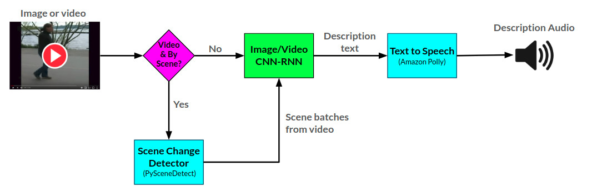
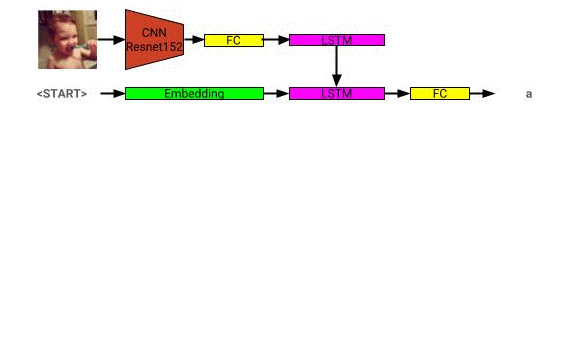
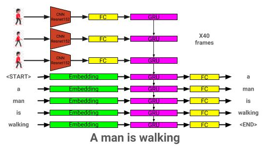

# Narrator
### A scene description generator.
====================================================

This library and service was created with the intention of helping content creators get AI generated auditory descriptions of scenes and images that they can use to make their content more accessible for people with vision impairment.

The Narrator library generates audio descriptions for provided images and videos using two CNN-RNN neural networks developed in PyTorch: 1) an image to text description network based on the show-and-tell network, and 2) an extension of this network into video to text description. The video description network can additionally be used to generate descriptions per scene in a video.


The overall arctitecture for Narrator can be seen here:



The image description model architecture can be seen here:



The video description model architecture can be seen here:


The Narrator is currently served in two ways: 1) a Flask web app currently being hosted on AWS and served via a [website](http://sraj.ca), and 2) a standalone library: Narrator.py. Examples of usage of the website can be seen on the website, and examples of using the library can be seen in notebooks/Narrator Usage Examples.ipynb.

The Narrator library uses [Amazon Polly](https://aws.amazon.com/polly/) to generate audio descriptions from text, and [PySceneDetect](https://pyscenedetect.readthedocs.io/en/latest/) for detecting scene changes within a video.

The image description network is trained using the COCO 2014 dataset.

The video description network is trained using the MSR-VTT dataset.

### Pre-trained Models
The current best pre-trained image description model can be downloaded from [here](https://drive.google.com/open?id=1bBaGTNBv3WsAYV-cGLIQeYw1C2EEZ3Sj).

The current best pre-trained video description model can be downloaded from [here](https://drive.google.com/open?id=1-B2LKqYS6Z1ecWLmqxpUDo8ZztiWFtOo).

Place these models in the models directory.

## Table of Contents
1. [Project organization](#project-organization)
2. [Requirements](#requirements)
3. [Performance](#performance)
4. [Train image description model](#train-image-description-model)
5. [Train video description model](#train-video-description-model)
<!-- 4. [How to train](#how-to-train)
5. [How to validate](#how-to-validate) -->

## Project organization
------------

    ├── LICENSE
    ├── README.md          <- The top-level README for developers using this project.
    ├── data
    │   ├── interim        <- Intermediate data that has been transformed.
    │   ├── processed      <- The final, canonical data sets for modeling.
    │   └── raw            <- The original, immutable data dump.
    │
    ├── models             <- Location to store trained models to be used by Narrator
    │
    ├── notebooks          <- Example Jupyter notebook + notebooks for validation
    │   ├── Narrator-Usage-Examples.ipynb        <- Examples of how to use Narrator independently of the web interface
    │   ├── Image-Captioner-Validation.ipynb     <- Notebook for validating image captioner model
    │   ├── Video-Captioner-Validation.ipynb     <- Notebook for validating video captioner model
    │   └── Data-Analysis.ipynb                  <- Notebook for analyzing image/data analysis
    │
    ├── results            <- Directory to store results
    │
    ├── samples            <- Image and video samples to use with Narrator.
    │
    ├── src                <- Source code for use in this project.
    │   ├── __init__.py    <- Makes src a Python module
    │   ├── ic_trainer.py  <- Module for training image description model
    │   ├── ic_validate.py <- Module for evaluating image description model
    │   ├── Narrator.py    <- Python class for deploying trained image/video description models
    │   ├── vc_trainer.py  <- Module for training video description model
    │   ├── vc_validate.py <- Module for evaluating video description model
    │   │
    │   ├── models        <- Scripts to prepare COCO/MSR-VTT datasets for training
    │   │   ├── EncoderCNN.py <-- Pre-trained CNN PyTorch model
    │   │   ├── ImageCaptioner.py <- Image Captioner Show-and-tell PyTorch Model
    │   │   ├── VideoCaptioner.py <- Video Captioner PyTorch Model
    │   │   ├── S2VTCaptioner.py <- S2VT PyTorch PyTorch Model
    │   │   ├── YoloObjectDetector.py <- Wrapper for yolo submodule
    │   │   └── pytorch-yolo-v3 <- git submodule: https://github.com/ayooshkathuria/pytorch-yolo-v3
    │   │
    │   ├── prepare        <- Scripts to prepare COCO/MSR-VTT datasets for training
    │   │   ├── build_coco_vocabulary.py
    │   │   ├── build_msrvtt_vocabulary.py
    │   │   ├── make_coco_dataset.py
    │   │   ├── make_msrvtt_dataset.py
    │   │   ├── preprocess_coco_images.py
    │   │   ├── preprocess_coco_objects.py
    │   │   ├── preprocess_msrvtt_objects.py
    │   │   └── preprocess_msrvtt_videos.py
    │   │
    │   └── utils          <- Assistance classes and modules
    │       ├── create_transformer.py  <- Create image transformer with torchvision
    │       ├── TTS.py                 <- Amazon Polly wrapper
    │       ├── ImageDataloader.py     <- Torch dataloader for the COCO dataset
    │       ├── VideoDataloader.py     <- Torch dataloader for the MSR-VTT dataset
    │       └── Vocabulary.py          <- Vocabulary class
    │   
    │
    └── web                <- Scripts/templates related to deploying web app with Flask

## Requirements

The dependencies can be downloaded using:

```
pip install -r requirements.txt
```

## Performance

### Image description model

| **Architecture** | **CNN** | **Initialization** | **Greedy** | **Beam = 3** |
| --- | --- | --- | --- | --- |
| LSTM (embed: 256) | Resnet152 | Random | 0.123 | 0.132 |
| GRU (embed:256)   | Resnet152 | Random | 0.122 | 0.131 |
| LSTM (embed: 256) | VGG16 | Random | 0.108 | 0.117 |

### Video description model

| **Architecture** | **CNN** | **Initialization** | **Greedy** | **Beam = 3** |
| --- | --- | --- | --- | --- |
| GRU (embed:256) | Resnet152 |Random | 0.317  | 0.351 |
| LSTM (embed: 256) | Resnet152 |Random | 0.305 | 0.320 |
| LSTM (embed: 256) | VGG16 |Random | 0.283 | 0.318 |
| LSTM (embed: 512) | Resnet152 |Random | 0.270 | 0.317 |
| LSTM (embed: 256) | Resnet152 |Pre-trained COCO | 0.278 |0.310 |

## Train image description model
This section will show how one can train their own image description model.

### 1. Prepare Data
First, the COCO dataset images and captions need to be preprocessed for training.

#### Extract captions for COCO
```
python3 src/prepare/make_coco_dataset.py \
    --coco_path <path_to_cocoapi>\
    --interim_results_path <interim_results_path>\
    --results_path <final_results_path>
```

--coco_path: path to cocoapi path (Can download from [here](https://github.com/cocodataset/cocoapi))

--interm_results_path: path to store interim results (default: data/interim/)

--results_path: path to store final results (default: data/processed/)

This additionally stores the combined captions dataset in <coco_path>/annotations/coco_captions.csv.

#### Build vocabulary files for COCO
```
python3 src/prepare/build_coco_vocabulary.py \
    --coco_path <path_to_cocoapi>\
    --vocab_path <desired_path_of_vocab>\
    --threshold <min_word_threshold>\
    --sets <coco_sets_to_include>
```

--coco_path: path to cocoapi path (Can download from [here](https://github.com/cocodataset/cocoapi))

--vocab_path: path to store coco vocabulary (defaults to data/processed/coco_vocab.pkl)

--threshold: min word occurance to be added to vocabulary (default: 5)

--sets: coco sets to include in vocabulary construction (default: 'train2014', 'train2017')

#### Preprocess images for COCO
```
python3 src/prepare/preprocess_coco_images.py \
    --model <base_model_type>\
    --dir <path_to_images_to_encode>\
    --continue_preprocessing <continue_preprocessing?>
```

--model: Base CNN model to use for preprocessing (options: ['resnet18', 'resnet50', 'resnet152', 'vgg11', 'vgg11_bn', 'vgg16', 'vgg16_bn', 'vgg19', 'vgg19_bn', 'squeezenet0', 'squeezenet1', 'densenet121', 'densenet201', 'inception'])

--dir: Path to coco images to encode using chosen model

--continue_processing: Encode remaining images in the directory

The encoded files will be placed in dir.

### 2. Train image description model
```
python3 src/ic_trainer.py \
    --models_path <path_to_store_models>\
    --beam_size <beam_size_to_use_during_validation>\
    --vocab_path <path_to_coco_vocab>\
    --captions_path <path_to_coco_captions_file>\
    --images_path <path_to_coco_image_embeddings>\
    --lr <learning_rate>\
    --val_interval <epoch_interval_to_validate_models>\
    --save_interval <epoch_inteval_to_save_model_checkpoints>\
    --num_epochs <epochs_to_train_for>\
    --initial_checkpoint_file <starting_model_checkpoint>\
    --version <model_version_number>\
    --batch_size <batch_size>\
    --coco_set <coco_set>\
    --load_features <load_or_construct_image_embeddings>\
    --load_captions <load_or_constructed_caption_encodings>\
    --preload <preload_image_and_caption_encodings_prior_to_training>\
    --base_model <CNN_encoder_model>\
    --embedding_size <size_of_image_embedding>\
    --embed_size <size_of_RNN_input>\
    --hidden_size <RNN_hidden_size>\
    --rnn_type <type_of_RNN_unit_to_use>
```

--models_path: Path to store the final model (default: models/)

--beam_size: Beam size for validation (default: 3)

--vocab_path: Path to coco vocab (default: data/processed/coco_vocab.pkl)

--captions_path: Path to coco captions (default: os.environ['HOME'] + '/programs/cocoapi/annotations/coco_captions.csv')

--images_path: Path to coco iamges (default: os.environ['HOME'] + '/Database/coco/images/')

--lr: Learning rate to use (default: 0.001)

--val_interval: Validation epoch frequency (default: 10)

--save_interval: Save checkpoint epoch frequency (default: 10)

--num_epochs: Number of epochs to train for (default: 1000)

--initial_checkpoint_file: Checkpoint to start training from (default: None)

--version: Model version number (default: 11)

--batch_size: Batch size (default: 64)

--coco_set: Coco dataset to train with (default: 2014)

--load_features: Option to load or construct image embeddings (default: True)

--load_captions: Option to load or construct caption embeddings (default: True)

--preload: Option to preload data to system memory prior to training (default: True)

--base_model: Base CNN model to use for preprocessing (options: ['resnet18', 'resnet50', 'resnet152', 'vgg11', 'vgg11_bn', 'vgg16', 'vgg16_bn', 'vgg19', 'vgg19_bn', 'squeezenet0', 'squeezenet1', 'densenet121', 'densenet201', 'inception'])

--embedding_size: Size of image embedding (default: 2048)

--embed_size: Size of RNN input (default: 256)

--hidden_size: Size of RNN hidden layer (default: 512)

--rnn_type: RNN type (default: 'lstm')

### 3. Validate image description model
```
python3 src/ic_validate.py \
    --model_path <path_to_trained_ic_model>\
    --beam_size <beam_size_to_use_during_validation>\
    --vocab_path <path_to_coco_vocab>\
    --captions_path <path_to_coco_captions_file>\
    --images_path <path_to_coco_image_embeddings>\
    --batch_size <batch_size>\
    --coco_set <coco_set>\
    --load_features <load_or_construct_image_embeddings>\
    --load_captions <load_or_constructed_caption_encodings>\
    --preload <preload_image_and_caption_encodings_prior_to_training>\
    --base_model <CNN_encoder_model>\
    --embedding_size <size_of_image_embedding>\
    --embed_size <size_of_RNN_input>\
    --hidden_size <RNN_hidden_size>\
    --rnn_type <type_of_RNN_unit_to_use>
```
--model_path: Path to trained ic model

--beam_size: Beam size for validation

--vocab_path: Path to coco vocab (default: data/processed/coco_vocab.pkl)

--captions_path: Path to coco captions (default: os.environ['HOME'] + '/programs/cocoapi/annotations/coco_captions.csv')

--images_path: Path to coco images (default: os.environ['HOME'] + '/Database/coco/images/')

--batch_size: Batch size (default: 64)

--coco_set: Coco dataset to train with (default: 2014)

--load_features: Option to load or construct image embeddings (default: True)

--load_captions: Option to load or construct caption embeddings (default: True)

--preload: Option to preload data to system memory prior to training (default: True)

--base_model: Base CNN model to use for preprocessing (options: ['resnet18', 'resnet50', 'resnet152', 'vgg11', 'vgg11_bn', 'vgg16', 'vgg16_bn', 'vgg19', 'vgg19_bn', 'squeezenet0', 'squeezenet1', 'densenet121', 'densenet201', 'inception'])

--embedding_size: Size of image embedding (default: 2048)

--embed_size: Size of RNN input (default: 256)

--hidden_size: Size of RNN hidden layer (default: 512)

--rnn_type: RNN type (default: 'lstm')

## Train video description model
This section will show how one can train their own video description model.

### 1. Prepare Data
First, the MSR-VTT dataset videos and captions need to be preprocessed for training.

#### Extract captions from MSR-VTT
```
python3 src/prepare/make_msrvtt_dataset.py \
    --raw_data_path <path_to_raw_msrvtt_data>\
    --interim_data_path <path_to_store_interim_data>\
    --final_data_path <path_to_store_final_data>\
    --continue_converting <continue_conversion>\
    --train_pct <percentage_to_allocate_to_training_set>\
    --dev_pct <percentage_to_allocate_to_development_set>
```

--raw_data_path: path to raw msrvtt data files (default: 'data/raw/videodatainfo_2017_ustc.json')

--interim_data_path: path to store interim results (default: 'data/interim/')

--final_data_path: path to store final results (default: 'data/processed/')

--continue_converting: Path to continue converting MSR-VTT dataset (default: True)

--train_pct: Percentage of dataset to use for training (default: 0.8)

--dev_pct: percentage of dataset to use for development (default: 0.15)

#### Build vocabulary files for MSR-VTT
```
python3 src/prepare/build_msrvtt_vocabulary.py \
    --captions_path <path_to_captions>\
    --vocab_path <desired_path_of_vocab>\
    --threshold <min_word_threshold>\
    --sets <coco_sets_to_include>
```

--coco_path: path to MSR-VTT captions generated by `make_msrvtt_dataset.py` (default: 'data/processed/msrvtt_captions.csv')

--vocab_path: path to store MSR-VTT vocabulary (defaults to data/processed/msrvtt_vocab.pkl)

--threshold: min word occurance to be added to vocabulary (default: 5)

#### Preprocess videos for MSR-VTT
```
python3 src/prepare/preprocess_msrvtt_videos.py \
    --model <base_model_type>\
    --dir <path_to_images_to_encode>\
    --continue_preprocessing <continue_preprocessing?>
    --resolution <CNN_input_resolution>\
    --num_frames <number_of_frames_to_encode>\
    --frames_interval <interval_between_frames>\
    --embedding_size <frame_embedding_size>\
```

--model: Base CNN model to use for preprocessing (options: ['resnet18', 'resnet50', 'resnet152', 'vgg11', 'vgg11_bn', 'vgg16', 'vgg16_bn', 'vgg19', 'vgg19_bn', 'squeezenet0', 'squeezenet1', 'densenet121', 'densenet201', 'inception'])

--dir: Path to MSR-VTT videos to encode using chosen model (default: os.environ['HOME'] + '/Database/MSR-VTT/train-video/')

--continue_processing: Encode remaining videos in the directory (default: True)

--resolution: CNN input resolution (default: 224)

--num_frames: Number of frames to encode (default: 40)

--frames_interval: Interval between frames (default: 1)

--embedding_size: CNN ouput resolution (default: 2048)

The encoded files will be placed in dir.

### 2. Train video description model
```
python3 src/vc_trainer.py \
    --models_path <path_to_store_models>\
    --beam_size <beam_size_to_use_during_validation>\
    --vocab_path <path_to_msrvtt_vocab>\
    --captions_path <path_to_msrvtt_captions_file>\
    --videos_path <path_to_msrvtt_video_embeddings>\
    --lr <learning_rate>\
    --val_interval <epoch_interval_to_validate_models>\
    --save_interval <epoch_inteval_to_save_model_checkpoints>\
    --num_epochs <epochs_to_train_for>\
    --initial_checkpoint_file <starting_model_checkpoint>\
    --version <model_version_number>\
    --batch_size <batch_size>\
    --load_features <load_or_construct_video_embeddings>\
    --load_captions <load_or_constructed_caption_encodings>\
    --preload <preload_image_and_caption_encodings_prior_to_training>\
    --base_model <CNN_encoder_model>\
    --embedding_size <size_of_frame_embedding>\
    --embed_size <size_of_RNN_input>\
    --hidden_size <RNN_hidden_size>\
    --rnn_type <type_of_RNN_unit_to_use>
```

--models_path: Path to store the final model (default: models/)

--beam_size: Beam size for validation (default: 3)

--vocab_path: Path to MSR-VTT vocab (default: data/processed/msrvtt_vocab.pkl)

--captions_path: Path to MSR-VTT captions (default: data/processed/msrvtt_captions.csv)

--videos_path: Path to MSR-VTT videos (default: os.environ['HOME'] + '/Database/MSR-VTT/train-video/')

--lr: Learning rate to use (default: 0.001)

--val_interval: Validation epoch frequency (default: 10)

--save_interval: Save checkpoint epoch frequency (default: 10)

--num_epochs: Number of epochs to train for (default: 1000)

--initial_checkpoint_file: Checkpoint to start training from (default: None)

--version: Model version number (default: 11)

--batch_size: Batch size (default: 64)

--load_features: Option to load or construct video embeddings (default: True)

--load_captions: Option to load or construct caption embeddings (default: True)

--preload: Option to preload data to system memory prior to training (default: True)

--base_model: Base CNN model to use for preprocessing (options: ['resnet18', 'resnet50', 'resnet152', 'vgg11', 'vgg11_bn', 'vgg16', 'vgg16_bn', 'vgg19', 'vgg19_bn', 'squeezenet0', 'squeezenet1', 'densenet121', 'densenet201', 'inception'])

--embedding_size: Size of frame embedding (default: 2048)

--embed_size: Size of RNN input (default: 256)

--hidden_size: Size of RNN hidden layer (default: 512)

--rnn_type: RNN type (default: 'lstm')

### 3. Validate image description model
```
python3 src/vc_validate.py \
    --model_path <path_to_trained_vc_model>\
    --beam_size <beam_size_to_use_during_validation>\
    --vocab_path <path_to_msrvtt_vocab>\
    --captions_path <path_to_msrvtt_captions_file>\
    --videos_path <path_to_msrvtt_video_embeddings>\
    --batch_size <batch_size>\
    --load_features <load_or_construct_video_embeddings>\
    --load_captions <load_or_constructed_caption_encodings>\
    --preload <preload_image_and_caption_encodings_prior_to_training>\
    --base_model <CNN_encoder_model>\
    --embedding_size <size_of_frame_embedding>\
    --embed_size <size_of_RNN_input>\
    --hidden_size <RNN_hidden_size>\
    --rnn_type <type_of_RNN_unit_to_use>
```
--model_path: Path to trained video description model

--beam_size: Beam size for validation

--vocab_path: Path to MSR-VTT vocab (default: data/processed/msrvtt_vocab.pkl)

--captions_path: Path to MSR-VTT captions (default: data/processed/msrvtt_captions.csv)

--videos_path: Path to MSR-VTT videos (default: os.environ['HOME'] + '/Database/MSR-VTT/train-video/')

--batch_size: Batch size (default: 64)

--load_features: Option to load or construct video embeddings (default: True)

--load_captions: Option to load or construct caption embeddings (default: True)

--preload: Option to preload data to system memory prior to training (default: True)

--base_model: Base CNN model to use for preprocessing (options: ['resnet18', 'resnet50', 'resnet152', 'vgg11', 'vgg11_bn', 'vgg16', 'vgg16_bn', 'vgg19', 'vgg19_bn', 'squeezenet0', 'squeezenet1', 'densenet121', 'densenet201', 'inception'])

--embedding_size: Size of frame embedding (default: 2048)

--embed_size: Size of RNN input (default: 256)

--hidden_size: Size of RNN hidden layer (default: 512)

--rnn_type: RNN type (default: 'lstm')
